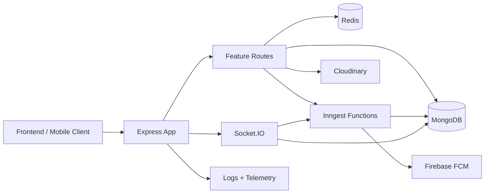

# Gemna Backend

Backend service for the Gemna platform. This service handles student onboarding, authentication, attendance workflows, real-time chat, notifications, background events, and runtime observability.

## Snapshot

| Area | What it does |
| --- | --- |
| Runtime | Node.js 22, Express 5, HTTP server + Socket.IO |
| Data | MongoDB with Mongoose models |
| Realtime | Socket.IO for chat, typing state, and online presence |
| Async work | Inngest for event-driven jobs, BullMQ files also exist as an alternate queue path |
| Storage | Cloudinary for uploaded images, local `public/` for static files |
| Session support | Redis for attendance session throttling |
| Notifications | Firebase Cloud Messaging and email fallback |
| Observability | Winston logs, rotating log files, OpenTelemetry hooks, request context |

## System Overview



The backend starts in [server.js](./server.js), where telemetry is bootstrapped first, MongoDB is connected, the Express app is loaded, and Socket.IO is attached to the HTTP server. The Express app itself is assembled in [app.js](./app.js) with security middleware, request logging, CORS, JSON parsing, feature routers, and a centralized 404/error layer.

## How The Backend Behaves

### 1. Student onboarding and account creation

1. `POST /student/image/upload/gemid` accepts a student image and pushes it through the upload pipeline.
2. `POST /student/gemnaId/validation` runs OCR-based GEMID validation against the uploaded image.
3. `POST /student/singup_with_gemna` stores the student registration form in MongoDB.
4. The registration controller emits an Inngest event to send the welcome/verification email asynchronously.
5. `POST /student/email/verification` and `POST /student/otp/verification` handle OTP verification and activate the student account.
6. `POST /student/login` issues JWT-based access for the student workspace.

### 2. Authenticated student workspace

Once a JWT is issued, `UserAccessMiddleware` validates it, loads the student from MongoDB, and attaches the populated user object to the request. Authenticated routes then support:

- account access and cached profile reads
- active student discovery by course, branch, year, and status
- direct chat connection lookup
- message history fetching
- notification token registration or disablement
- profile image upload with Cloudinary

### 3. Attendance workflow

Attendance endpoints are isolated under `/api/attendance` and `/api/subject`.

- `POST /api/attendance` checks whether a student already exists in attendance records.
- If not found, Redis is used to create a short-lived session window for controlled registration attempts.
- `POST /api/attendance/register/user` stores a new attendance student record after Zod validation.
- Subject endpoints fetch related subjects, link selected subjects to a student, return linked subject data, and save timetable blocks.

This area mixes MongoDB persistence with Redis-backed session throttling to reduce duplicate or abusive registration attempts.

### 4. Real-time messaging

Socket connections are attached at server startup. Each socket:

1. sends an encrypted auth payload
2. is verified in `AuthBYSocket`
3. is added to the in-memory `SocketSingleton`
4. joins a branch/year room for presence broadcasts
5. can send live messages, typing events, and offline-delivery messages

When the receiver is offline, the backend persists the message and emits an Inngest notification event. That event later tries Firebase push delivery and falls back to email if no valid FCM token exists.

## Request Lifecycle

```text
Incoming request
-> security + cookies + request context + HTTP logger
-> CORS and body parsing
-> feature router
-> controller / middleware validation
-> database or service integration
-> JSON response
-> notFoundHandler / errorHandler if needed
```

Cross-cutting concerns currently wired into the app:

- `helmet()` for baseline HTTP hardening
- cookie parsing for OAuth/state handling
- request-scoped logging context
- structured HTTP logs
- centralized 404 + error handling
- optional OpenTelemetry export

## Backend Structure

```text
Backend/
|-- app.js
|-- server.js
|-- config/
|   `-- env.js
|-- Controller/
|   |-- AttendanceController/
|   |-- ZodSchema/
|   |-- student.fetchdata.controller.js
|   |-- student.upload.controller.js
|   `-- studentAccessController.js
|-- Route/
|   |-- AttendanceCore/
|   |-- student.auth.google.js
|   |-- student.fetchdata.router.js
|   |-- student.upload.image.js
|   `-- system.routes.js
|-- middleware/
|   |-- AttendanceMiddleware/
|   |-- errorHandler.js
|   |-- student.upload.middleware.js
|   `-- studentAccessMiddleware.js
|-- model/
|   |-- Attendence_Section/
|   |-- Students.js
|   |-- connection.model.js
|   |-- message.model.js
|   |-- otp.student.schema.js
|   `-- student.form.schema.js
|-- service/
|   |-- BullMQ/
|   |-- Email/
|   |-- Inngest/
|   |-- NotificationSystem/
|   |-- Redis/
|   |-- db.js
|   `-- pdf.generation.js
|-- socket/
|   |-- AuthBYSocket.js
|   `-- socket.io.js
|-- observability/
|   |-- httpLogger.js
|   |-- logger.js
|   |-- requestContext.js
|   `-- telemetry.js
|-- components/
|-- utils/
|-- module/
|-- ResponseStructure/
|-- JsonData/
`-- public/
```

## Folder Responsibilities

| Folder | Responsibility |
| --- | --- |
| `config/` | Environment parsing, defaults, required variable validation |
| `Route/` | HTTP route registration and feature grouping |
| `Controller/` | Request orchestration and main business flow |
| `middleware/` | Authentication, payload guards, attendance checks, global errors |
| `model/` | Mongoose schemas for students, chat, OTP, attendance, and relations |
| `service/` | Database, Redis, email, queue, notification, PDF, Inngest integrations |
| `socket/` | WebSocket auth and event handling |
| `observability/` | Logs, request context, OpenTelemetry setup |
| `components/` | Shared helper utilities such as crypto, OCR validation, ID generation, and uploads |
| `utils/` | Utility wrappers like Multer and Vercel KV helpers |

## Main Route Surface

| Base path | Purpose |
| --- | --- |
| `/` | Home route and Google OAuth callback flow |
| `/system` | Health and readiness checks |
| `/student` | Student onboarding, login, profile access, image upload |
| `/api/v1/students` | Student discovery, connections, messages, notification token updates |
| `/api/inngest` | Inngest handler endpoint |
| `/api/attendance` | Attendance session and registration flow |
| `/api/subject` | Subject lookup, linking, and timetable scheduling |
| `/files` | Static file serving from `public/` |

### Health endpoints

- `GET /system/health` returns service, environment, uptime, and telemetry status.
- `GET /system/ready` returns readiness based on MongoDB connection state.

## Data And Integration Design

### MongoDB

MongoDB is the source of truth for:

- registered student profiles
- active login accounts
- OTP logs
- attendance records
- subject/teacher mappings
- chat connections and messages

### Redis

Redis is used for lightweight, short-lived attendance session control. It is not the primary system of record; it mainly supports anti-duplication and session-expiration behavior during attendance onboarding.

### Inngest

Inngest is the actively wired async orchestration layer in the current backend. It is used for:

- registration email dispatch
- offline notification fanout
- scheduled keep-alive requests

### BullMQ

BullMQ queue and worker files are present in the codebase, but they are not part of the main startup path in `server.js`. Treat this as an alternate or legacy async path unless the runtime is explicitly extended to launch the worker process.

## Environment Variables

### Required at startup

- `JWT_SECURE`
- `JSON_SECRET_KEY`

### Important for normal backend behavior

- `DATABASE_URL` or `BATABASE_URL`
- `FRONTEND_URL`
- `BACKEND_URL`
- `CLOUD_NAME`
- `CLOUD_API_KEY`
- `CLOUD_SECRET_KEY`
- `NAME`
- `PASSWORD`
- `REDIS_HOST` / `REDIS_PORT` / `REDIS_PASS`
- `INNGEST_EVENT_KEY`
- `GOOGLE_CLIENT_ID`
- `GOOGLE_CLIENT_SECRET`
- `FIREBASE_PROJECT_ID`
- `FIREBASE_CLIENT_EMAIL`
- `FIREBASE_PRIVATE_KEY`

### Optional observability settings

- `OTEL_ENABLED`
- `OTEL_TRACES_ENABLED`
- `OTEL_METRICS_ENABLED`
- `OTEL_EXPORTER_OTLP_ENDPOINT`
- `OTEL_EXPORTER_OTLP_HEADERS`
- `LOG_LEVEL`
- `LOG_DIRECTORY`

## Local Development

```bash
cd Backend
npm install
npm run dev
```

Default expectations from the current code:

- Node.js `22.x`
- MongoDB available before app startup completes
- Redis available if attendance/session flows are used
- Cloudinary configured for image workflows
- Email credentials configured for OTP and welcome mail

## Observability And Runtime Safety

The backend already includes a good base for production visibility:

- request-aware structured logs with secret redaction
- rotating log files
- telemetry bootstrap and shutdown hooks
- startup warnings for missing optional integrations
- centralized error logging
- graceful shutdown on `SIGINT` and `SIGTERM`

## Stability Notes

These are useful things to keep in mind while working on this backend:

- The codebase contains both current and older patterns side by side; Inngest is clearly active, while BullMQ looks secondary.
- Controllers still contain a lot of direct orchestration logic, so bugs are most likely to appear when route behavior changes without updating shared docs or validation.
- Automated test coverage is not yet formalized in the package scripts, so manual verification is still important after changing auth, upload, attendance, or socket flows.
- Some integrations are optional at boot, but features depending on them will degrade if the related environment variables are missing.

## Suggested Maintenance Rule

When adding a new backend feature, update these four layers together:

1. route
2. controller/service
3. validation or middleware
4. this README

That keeps the system easier to reason about and reduces later bug-fix work caused by outdated documentation.
